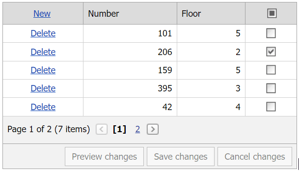

<!-- default badges list -->

[](https://supportcenter.devexpress.com/ticket/details/T401286)
[](https://docs.devexpress.com/GeneralInformation/403183)
<!-- default badges end -->
# Grid View for ASP.NET MVC - Implement the Select All check box for a templated column in batch edit mode

This example demonstrates how to create a header template, add a check box to the template, and implement the Select All functionality in batch edit mode.



## Overview

Follow the steps below to implement the **Select All** functionality in a column's header in batch edit mode:

1. Call a column's [SetHeaderTemplateContent](https://docs.devexpress.com/AspNetMvc/DevExpress.Web.Mvc.MVCxGridViewColumn.SetHeaderTemplateContent.overloads) method and add a check box editor to the template.

    ```csharp
    settings.Columns.Add(column => {
        column.FieldName = "IsReserved";
        column.ColumnType = MVCxGridViewColumnType.CheckBox;
        column.EditorProperties().CheckBox(p => {
            p.ClientSideEvents.CheckedChanged = "OnCellCheckedChanged";
            p.ValidationSettings.Display = Display.Dynamic;
        });
        column.SetHeaderTemplateContent(c => {
            ViewContext.Writer.Write("<div style='text-align:center;'>");
            Html.DevExpress().CheckBox(headerCheckBoxSettings => {
                headerCheckBoxSettings.Name = "HeaderCheckBox";
                headerCheckBoxSettings.Properties.AllowGrayed = true;
                headerCheckBoxSettings.Properties.AllowGrayedByClick = false;
                headerCheckBoxSettings.Properties.ClientSideEvents.CheckedChanged = "OnHeaderCheckBoxCheckedChanged";
                headerCheckBoxSettings.Properties.ClientSideEvents.Init = "OnInitHeader";
            }).GetHtml();
            ViewContext.Writer.Write("</div>");
        });
    });
    ```

2. Handle the editor's client-side `CheckedChanged` event. In the handler, call the grid's [SetCellValue](https://docs.devexpress.com/AspNet/js-ASPxClientGridViewBatchEditApi.SetCellValue(visibleIndex-columnFieldNameOrId-value)) method to assign a value to the specified cell based on a check box state.

    ```js
    function OnHeaderCheckBoxCheckedChanged(s, e) {
        var visibleIndices = Grid.batchEditApi.GetRowVisibleIndices();
        var totalRowsCountOnPage = visibleIndices.length;
        for (var i = 0; i < totalRowsCountOnPage ; i++) {
            Grid.batchEditApi.SetCellValue(visibleIndices[i], "IsReserved", s.GetChecked())
        }
    }
    ```

3. Handle the grid's client-side [BatchEditEndEditing](https://docs.devexpress.com/AspNet/js-ASPxClientGridView.BatchEditEndEditing), [BatchEditRowDeleting](https://docs.devexpress.com/AspNet/js-ASPxClientGridView.BatchEditRowDeleting), and [BatchEditRowInserting](https://docs.devexpress.com/AspNet/js-ASPxClientGridView.BatchEditRowInserting) events. In the handlers, call the `CheckSelectedCellsOnPage` function. In this function, compare the number of selected rows and the total number of visible rows. Based on a result, specify the state of the checkbox editor.

    ```js
    function CheckSelectedCellsOnPage(checkType) {
        var currentlySelectedRowsCount = 0;
        var visibleIndices = Grid.batchEditApi.GetRowVisibleIndices();
        var totalRowsCountOnPage = visibleIndices.length;
        for (var i = 0; i < totalRowsCountOnPage ; i++) {
            if (Grid.batchEditApi.GetCellValue(visibleIndices[i], "IsReserved"))
                currentlySelectedRowsCount++;
        }
        if (checkType == "insertCheck")
            totalRowsCountOnPage++;
        else if (checkType == "deleteCheck") {
            totalRowsCountOnPage--;
            if (DeletedValue)
                currentlySelectedRowsCount--;
        }
        if (currentlySelectedRowsCount <= 0)
            HeaderCheckBox.SetCheckState("Unchecked");
        else if (currentlySelectedRowsCount >= totalRowsCountOnPage)
            HeaderCheckBox.SetCheckState("Checked");
        else
            HeaderCheckBox.SetCheckState("Indeterminate");
    }
    ```

## Files to Review

* [GridViewPartialView.cshtml](./CS/T401286/Views/Home/GridViewPartialView.cshtml)
* [Index.cshtml](./CS/T401286/Views/Home/Index.cshtml)

## Documentation

* [Grid View Templates](https://docs.devexpress.com/AspNetMvc/14721/common-features/templates)
* [Batch Edit Mode](https://docs.devexpress.com/AspNetMvc/16147/components/grid-view/data-editing-and-validation/batch-edit)

## More Examples

* [Grid View for ASP.NET Web Forms - Implement the Select All check box for a templated column in batch edit mode](https://github.com/DevExpress-Examples/asp-net-web-forms-grid-select-all-checkbox-in-batch-edit-mode)
